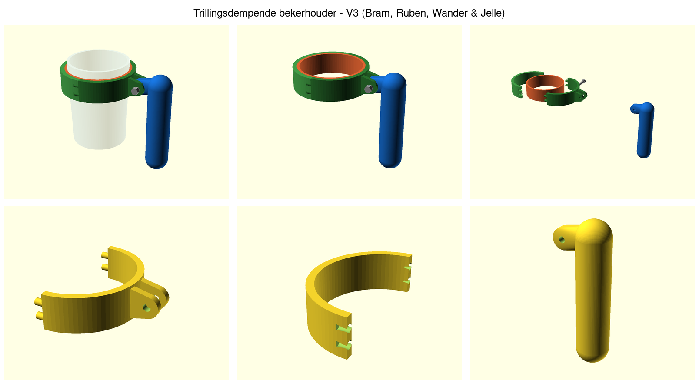
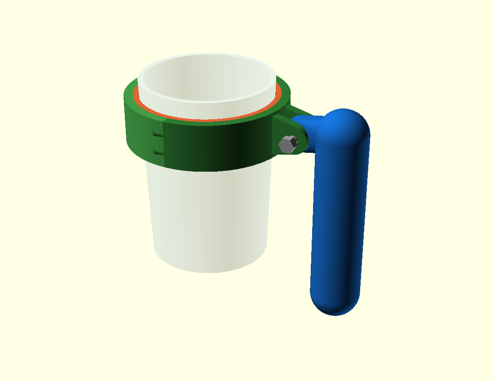
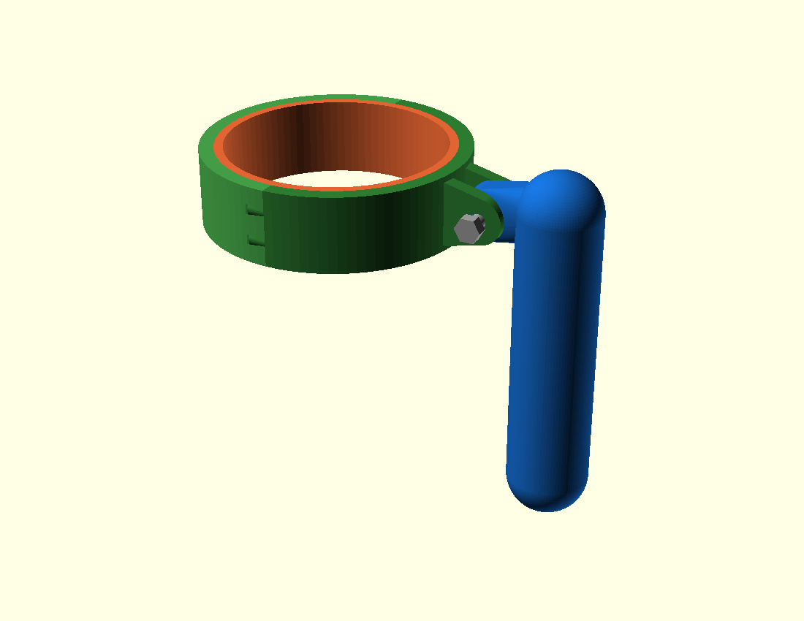
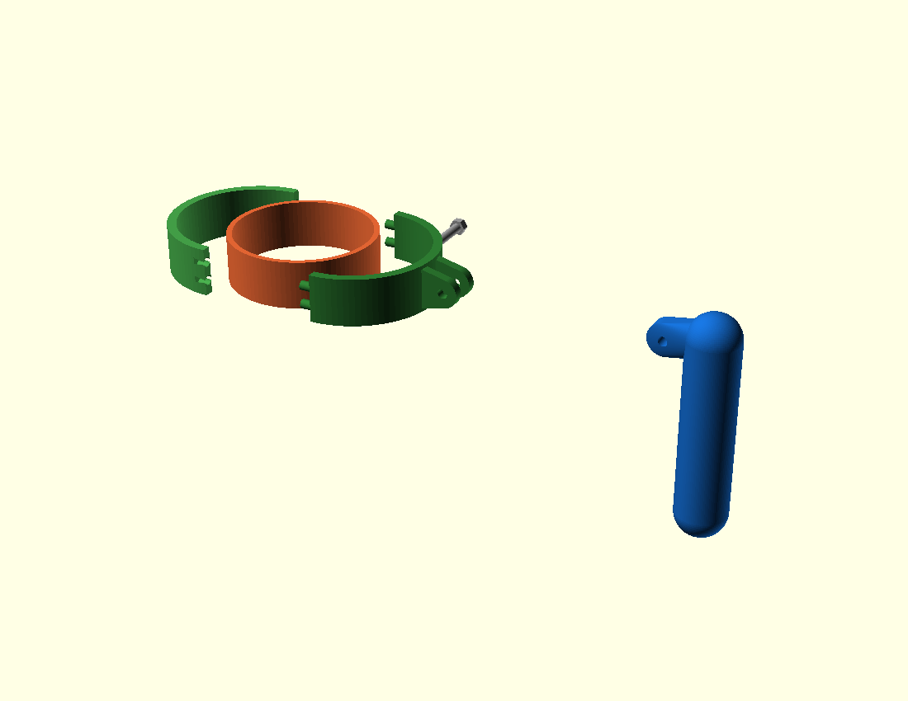
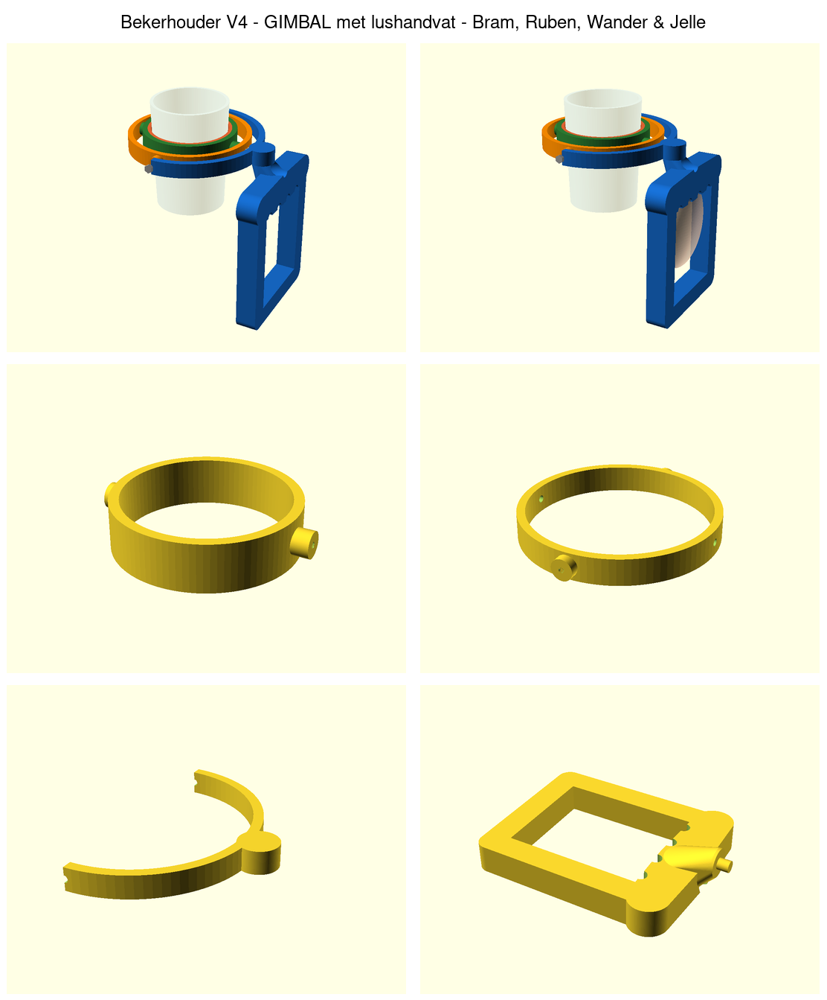
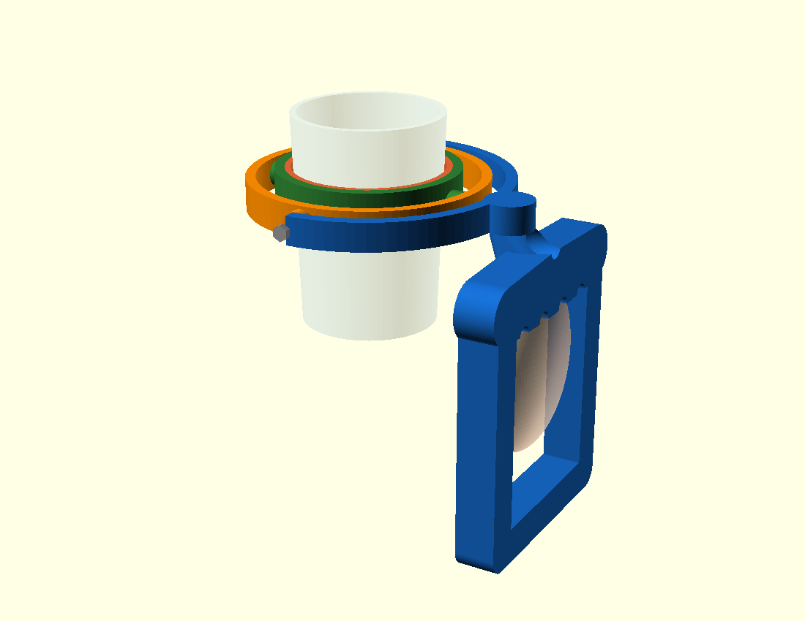
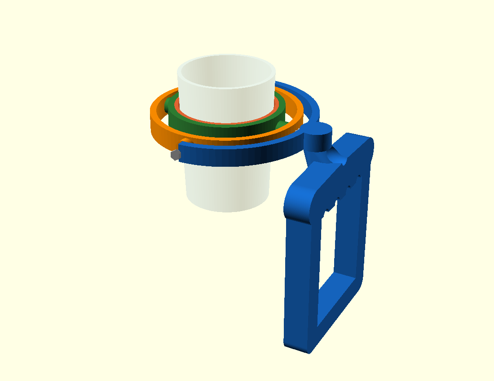
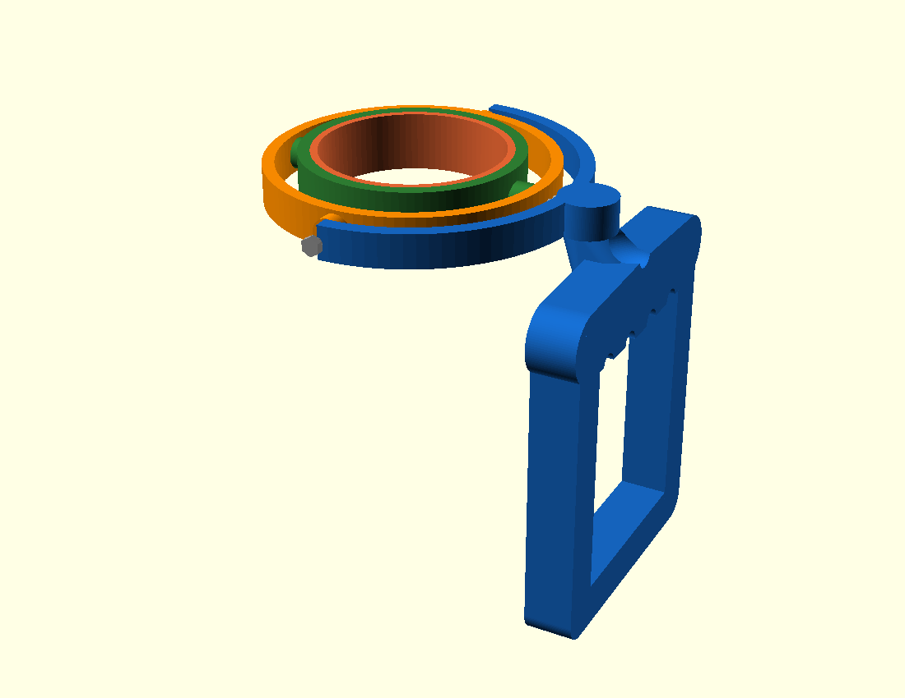
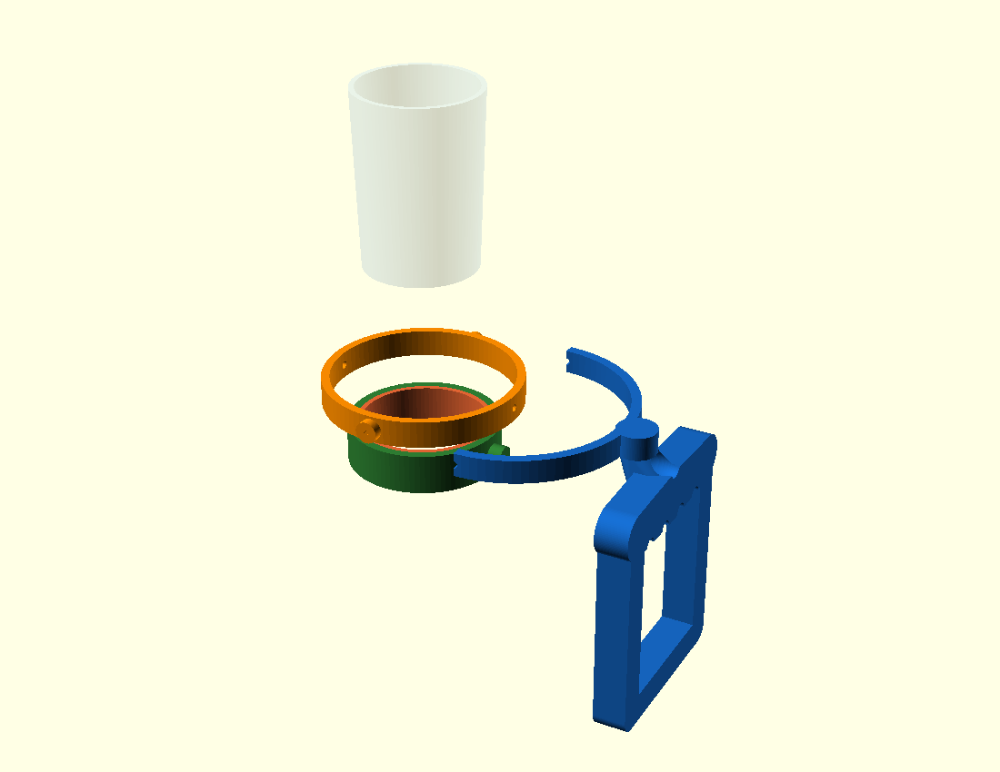

# Trillingsdempende bekerhouder voor mensen met Parkinson

**NLT – Technisch Ontwerpen** · Bram, Ruben, Wander & Jelle · Spinoza20First – HAVO 4

Dit is het **visuele/fysieke product** bij ons ontwerpverslag, uitgewerkt als
3D-model. Je kunt de bestanden direct laten **3D-printen** of openen in
**Tinkercad** om aan te passen. Er zijn **twee versies**:

| Versie | Beschrijving | Draaipunten |
|---|---|---|
| **V3** | Ring in twee helften + vrij draaiend handvat (ons verslagontwerp) | 1 as |
| **V4 – Gimbal** ⭐ | Upgrade: échte gimbal, blijft in **alle** richtingen waterpas + **lushandvat** (hand past erdoor) | 2 assen |



> 🆕 De **gimbal-upgrade (V4)** staat verderop in [hoofdstuk 9](#9-upgrade-versie-v4--echte-gimbal).

---

## 1. Het idee in het kort

Een 3D-geprinte **ring in twee helften** klemt met een **siliconen binnenrand**
om de beker. Aan de zijkant zit een **handvat** dat via **één bout** vrij kan
draaien ten opzichte van de ring.

> **Werking:** de gebruiker houdt het handvat vast. Trilt of draait de hand, dan
> draait het *handvat* mee, maar de *ring en de beker* blijven door het vrije
> draaipunt en de zwaartekracht hangen. Zo wordt de trilling van de hand niet
> doorgegeven aan de beker (een soort gimbal-/slingerprincipe).

| Aanzicht | Beeld |
|---|---|
| Op een beker |  |
| Product los |  |
| Explosietekening |  |

---

## 2. Wat zit er in deze map?

```
bekerhouder-parkinson/
├── src/
│   ├── bekerhouder.scad          ← V3 bronontwerp (parametrisch, OpenSCAD)
│   └── bekerhouder_gimbal.scad   ← V4 gimbal bronontwerp
├── stl/                          ← printklare / Tinkercad-bestanden
│   ├── ring_helft_A.stl          ← V3: Ring helft A (met vork)
│   ├── ring_helft_B.stl          ← V3: Ring helft B (vlak)
│   ├── handvat.stl               ← V3: Handvat
│   ├── gimbal_binnenring.stl     ← V4: Binnenring (bekerklem)
│   ├── gimbal_middenring.stl     ← V4: Middenring (gimbalring)
│   ├── gimbal_handvat_beugel.stl ← V4: Beugel (printt plat)
│   ├── gimbal_handvat_greep.stl  ← V4: Lusgreep (grijpbalk + veiligheidslus)
│   ├── gimbal_handvat_1geheel.stl← V4: handvat als 1 geheel (alternatief)
│   └── *_printplaat_compleet.stl ← alle delen in één bestand (per versie)
├── img/                          ← afbeeldingen voor het verslag
├── render.sh                     ← genereert V3 plaatjes + STL's
└── render_gimbal.sh              ← genereert V4 plaatjes + STL's
```

De **3 printdelen** komen precies overeen met onze stuklijst:
Ring helft A, Ring helft B en het Handvat.

---

## 3. Stuklijst (zelfde als in het verslag)

| Nr. | Onderdeel | Materiaal | Aantal | Verkrijgen via |
|----|------------------------|-----------|--------|----------------|
| 1 | Ring helft A | PLA | 1× | 3D-printer (`ring_helft_A.stl`) |
| 2 | Ring helft B | PLA | 1× | 3D-printer (`ring_helft_B.stl`) |
| 3 | Handvat | PLA | 1× | 3D-printer (`handvat.stl`) |
| 4 | Bout M5 × 30 mm | Staal | 1× | Bouwmarkt |
| 5 | Zelfborgende moer M5 | Nylon | 1× | Bouwmarkt |
| 6 | Sluitring M5 | Staal | 2× | Bouwmarkt |
| 7 | Siliconen binnenrand | Silicoon | 1× | Bouwmarkt |
| 8 | Contactlijm | – | 1× | Bouwmarkt |

---

## 4. 3D-printen

**Aanbevolen instellingen (PLA):**

| Instelling | Waarde |
|---|---|
| Laaghoogte | 0,2 mm |
| Wanden / perimeters | 3 |
| Vulling (infill) | 30–40 % |
| Support | **Ja**, voor de vork van helft A en de uitstekende pennen |
| Brim | Aan te raden (ringhelften staan smal op de plaat) |

**Print-oriëntatie:**
- **Ringhelften:** rechtop, met de onderrand op de printplaat.
- **Handvat:** plat liggend, met de tong op de plaat.

> 💡 De ringhelften klikken met **pennen** in elkaar. Past het te strak of te
> los? Pas in de slicer de schaal ~0,5 % aan, of wijzig `peg_hole` in het
> ontwerp (zie §6). Dit testen-en-bijstellen hoort bij het prototypen — een mooi
> punt voor hoofdstuk 7 & 8 van het verslag.

---

## 5. Aanpassen in **Tinkercad**

1. Ga naar [tinkercad.com](https://www.tinkercad.com) → log in.
2. Maak een nieuw ontwerp → knop **Import** (rechtsboven).
3. Kies een `.stl`-bestand uit de map `stl/` (bv. `ring_helft_A.stl`).
4. Het onderdeel verschijnt als bewerkbare vorm; je kunt schalen, gaten
   toevoegen, tekst graveren (bv. jullie namen), enzovoort.
5. Importeer de drie delen apart als je het geheel wilt samenstellen.

> Tinkercad importeert ook `printplaat_compleet.stl` als je alles in één keer
> wilt zien.

---

## 6. Maten aanpassen (parametrisch ontwerp)

Het bronbestand `src/bekerhouder.scad` is **parametrisch**: bovenaan staan de
belangrijkste maten. De belangrijkste om aan te passen:

| Variabele | Betekenis | Standaard |
|---|---|---|
| `cup_d` | buitendiameter van jullie beker | 75 mm |
| `liner_t` | dikte siliconen binnenrand | 3 mm |
| `wall` | wanddikte van de ring | 5 mm |
| `ring_h` | hoogte van de ring | 26 mm |
| `bolt_d` / `hole_d` | boutmaat + gat | M5 |

**Belangrijk:** meet je eigen beker en zet die maat in `cup_d`. De ring schaalt
dan automatisch mee.

Opnieuw genereren (met [OpenSCAD](https://openscad.org) geïnstalleerd):

```bash
./render.sh        # maakt alle img/*.png én stl/*.stl opnieuw
```

Of open `src/bekerhouder.scad` in OpenSCAD en exporteer met **File → Export → STL**.

---

## 7. Montage

1. **Siliconen binnenrand** in beide ringhelften lijmen met **contactlijm** (deel 8).
2. Beker tussen de twee ringhelften plaatsen en de helften met de **pennen**
   in elkaar drukken tot ze klikken.
3. **Handvat** met de tong in de vork van helft A schuiven.
4. **Bout** met een **sluitring** door de vork + tong steken, aan de andere kant
   een **sluitring** en de **zelfborgende moer**.
5. Moer net zo ver aandraaien dat het handvat **soepel vrij kan draaien**
   (niet vastzetten!). Dat vrije draaipunt is precies wat de trilling dempt.

---

## 8. Hoe dit aansluit op het programma van eisen

| Eis | Hoe het ontwerp hieraan voldoet |
|---|---|
| 1. Trillingen dempen | Vrij draaiend handvat ontkoppelt hand van beker |
| 2. Stabiliteit | Ring klemt rondom; beker hangt uitgebalanceerd |
| 3. Licht gewicht | Holle PLA-print, ~30–40 % vulling |
| 4. Comfort | Afgeronde, ergonomische greep |
| 5. Universeel | `cup_d` aanpasbaar + siliconen rand vangt verschil op |
| 6. Eenvoud | Klik de ring dicht, klaar |
| 7. Maakbaarheid | 3 simpele printdelen + standaard boutje |
| 8. Veiligheid | Geen scherpe randen, alles afgerond |
| 9. Betaalbaar | Weinig PLA + 1 boutje, makkelijk te reproduceren |
| 10. Uiterlijk | Strakke ring + handvat, valt niet op als "hulpmiddel" |

---

## 9. Upgrade: versie V4 – echte gimbal

In V3 dempt het handvat de trilling om **één** as. Met een **gimbal** lossen we
dat in **alle** richtingen op – hetzelfde principe als een scheepskompas dat
altijd waterpas blijft. Daarnaast heeft V4 een **ergonomisch lushandvat**:
- een **dikke, gevormde grijpbalk** (~32 mm) met **vingergroeven** en een
  **duimsteun**, zodat je hand er stevig en comfortabel omheen vouwt;
- met een **gesloten veiligheidslus** eromheen waar je hand doorheen gaat.

Zo heb je het goed vast én blijft het om je hand hangen, ook met een zwakke of
trillende grip — je hoeft niet hard te knijpen. Ideaal voor mensen met Parkinson.





### Hoe werkt de gimbal?

Twee ringen met **twee loodrechte draaiassen**:

- De **binnenring** klemt de beker en draait om de **X-as** t.o.v. de middenring.
- De **middenring** draait om de **Y-as** t.o.v. het handvat.

Omdat de twee assen loodrecht op elkaar staan en de beker eronder hangt, blijft
de beker **waterpas, hoe je het handvat ook kantelt**. Tremoren in elke richting
worden zo opgevangen.

| Aanzicht | Beeld |
|---|---|
| Op een beker |  |
| Product los |  |
| Explosietekening |  |

### Printdelen (V4)

Het handvat is **in twee delen gesplitst zodat alles makkelijk en zonder lastige
support print**:

| STL | Onderdeel | Printstand |
|---|---|---|
| `gimbal_binnenring.stl` | Binnenring – klemt de beker, draaipunten op de X-as | rechtop |
| `gimbal_middenring.stl` | Middenring – gimbalring, draaipunten op beide assen | rechtop |
| `gimbal_handvat_beugel.stl` | Beugel – houdt de gimbalring vast | **plat op de bed** |
| `gimbal_handvat_greep.stl` | Lusgreep – dikke grijpbalk + veiligheidslus | **plat op de bed** |

> Liever in één keer? `gimbal_handvat_1geheel.stl` is hetzelfde handvat als één
> stuk, maar dat heeft wél support nodig. De gesplitste versie print het fijnst.

### Printinstellingen (V4)

| Onderdeel | Support | Tip |
|---|---|---|
| Binnenring / middenring | licht, voor de oogjes | brim aanraden |
| **Beugel** | **geen** | ligt plat, perfecte hechting |
| **Lusgreep** | **geen** | de lus ligt plat op de bed (vlakke kant onder) |

### Stuklijst (V4)

| Onderdeel | Aantal | Via |
|---|---|---|
| Binnenring, middenring, beugel, greep (PLA) | elk 1× | 3D-printer |
| Bout M4 × 16 mm | 4× | Bouwmarkt |
| Zelfborgende moer M4 *of* M4 in PLA tappen | 4× | Bouwmarkt |
| Sluitring M4 | 4× | Bouwmarkt |
| Siliconen binnenrand | 1× | Bouwmarkt |
| Contactlijm (greep ↔ beugel) | 1× | Bouwmarkt |

### Montage (V4)

1. **Greep aan de beugel:** het pennetje van de greep in het gat van de beugel
   steken en vastlijmen met **contactlijm** (eventueel een schroefje van onderaf
   door de beugel in de greep voor extra sterkte).
2. **Siliconen rand** in de binnenring lijmen.
3. **Binnenring in de middenring** leggen; de twee oogjes (X-as) uitlijnen met de
   gaten in de middenring. Aan elke kant een **M4-bout** indraaien – net zo strak
   dat de binnenring **soepel kantelt**.
4. **Middenring in de beugel** plaatsen; de trunnions (Y-as) uitlijnen met de
   gaten in de beugel en met **M4-bouten** vastzetten – ook hier soepel laten
   draaien.
5. **Beker** van bovenaf in de binnenring schuiven; de siliconen rand grijpt hem
   vast.

> ⚙️ De truc zit in stap 3 en 4: de bouten mogen **niet vastgeklemd** worden. De
> ringen moeten vrij kunnen draaien, anders werkt de gimbal niet.

### V4 aanpassen

Net als V3 is `src/bekerhouder_gimbal.scad` parametrisch (zet je eigen `cup_d`).
Opnieuw genereren met `./render_gimbal.sh`.

---

> 💡 **Tip voor het verslag (H7 & H8):** beschrijf in *“Verslag prototype”* welke
> versie je print en waarom, en gebruik *“Evaluatie/reflectie”* om V3 en V4 te
> vergelijken (1 as vs. 2 assen, simpel vs. beter dempend). Het bijstellen van de
> klik-/draaipassing na een testprint is precies het soort reflectie dat daar
> goed past.
